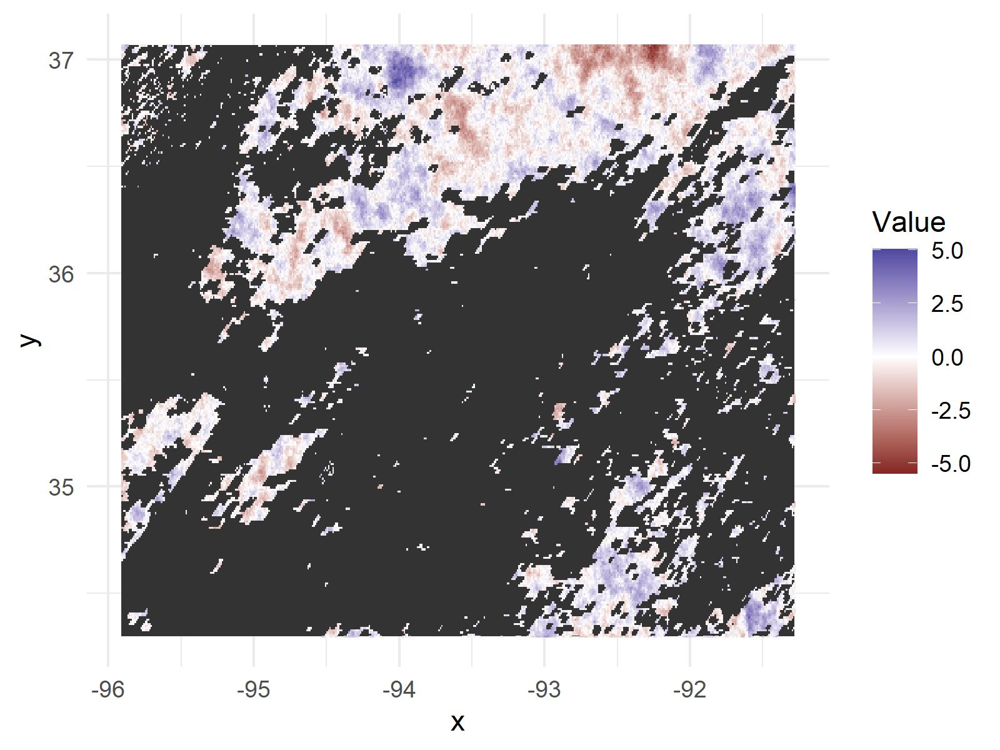

# Neural Nets as Gaussian Processes

## Introduction

This repository contains collaborative research work done with Dr. Matthew Heaton, a professor in the Department of Statistics at Brigham Young University actively researching areas in spatial statistics ([https://statistics.byu.edu/directory/heaton-matthew](https://statistics.byu.edu/directory/heaton-matthew)). We used the code in this repository for the research covered in my Master's project writeup, [**Substituting Neural Networks for Gaussian Processes**](https://github.com/skylerg022/nn-as-gp/blob/main/masters_writeup_4_15.pdf), and appended work following the report dated April 15, 2022. This research work is evangelical in nature, preaching the gospel of neural networks to the statistical community as a viable option for predictive modeling in lieu of intractable Gaussian process modeling for big data.

The purpose of sharing this code is not to provide polished new functions to the community but rather to facilitate replicability of research results. Given the repository structure, you may extend this research to some new dataset with relative ease.

This code facilitates formatting and fitting fully-connected neural networks to big data with only 2-dimensional location information and a continuous or binary outcome for each observation. We optimize hyperparameter settings via gridsearch and fit a neural net to big data and evaluate our predictions for some withheld test set. Below is an example of fitting a neural network to the simulated surface temperature training data from the **Quant150K_Sim** dataset (left). The performance of our best fit neural network (predicted - actual) on extrapolating surface temperatures for regions with cloud cover is also included (right).

  
  

## Requirements

This code requires a Linux based environment to run the multi-core parallel processing used in the gridsearch algorithm. Therefore, a macOS or Linux distribution (NOT Windows) is required to run the analysis code.

## Directions

To perform the gridsearch and fit the best neural network models to the data, first prepare the data for analysis. Create a dataset name (with no spaces) in the **dataset** directory. Create an **eda.R** file in this new directory as well as a **data** directory with the original dataset file, whether it is a csv, txt, or other type of file.

Using the existing **eda.R** files as an example, read in the data, investigate the data, and prepare the data to save as six different matrix objects. Let x_train, x_val, and x_test be the 2-column matrices that represent the location of each observation and y_train, y_val, and y_test be 1-column matrices with the response variable. Save all of these variables into the data file **data/DataSplit.RData**.

R CMD BATCH --no-save --no-echo '--args Binary1Million TRUE' grid_analysis.R analysis.Rout &

## Directory Structure

Each dataset analysis is contained the **datasets** directory. Within **Quant150K_Sim**, for example,

The files within each dataset are meant to be used in the following order:

1. eda.R: The data is visualized and split into the proper train, validation, and test set objects if necessary.

2. gridsearch.R: This file contains the code to run to evaluate different hyperparameter settings, i.e. different neural network setups.

3. grid_analysis.R: This code pulls from the grid search results saved in the **data** folder to help the investigator pick the neural network settings that minimize the loss function for the validation data.

4. fit_NNs.R: Code to fit the final eight best-performing models (each with a different input transformation or a different grid for grid search)

5. test_eval.R: Code to evaluate the model fit to the true test data if test response data is available.

Notes were taken in notes.txt while analyzing the grid search results to find quantitative patterns in the data.

Helper functions are included in the **functions** directory and are used in the analysis files. The **concepts** directory contains modeling concepts that are discussed in the [Master's project report](https://github.com/skylerg022/nn-as-gp/blob/main/masters_writeup_4_15.pdf).

## Data

No data are included in this repository but can be retrieved elsewhere. The land surface temperature data (for Quant150K and Quant150K_Sim) is available at [https://github.com/finnlindgren/heatoncomparison/tree/master/Data](https://github.com/finnlindgren/heatoncomparison/tree/master/Data). The quantitative 1-million Guassian and Non-Gaussian datasets come from the "Competition on Spatial Statistics for Large Datasets" by Huang et al. (2021) and are available at [https://doi.org/10.25781/KAUST-8VP2V](https://doi.org/10.25781/KAUST-8VP2V). After downloading the files, create a **data** directory in the respective project folders (for example, the directory **Quant1Mil_G5/data**) and move the data files to their their appropriate **data** directory.

## Analysis Progress

#### Finished Analyses

- Quant1Mil_G5
- Quant1Mil_NG1
- Quant150K_Sim

#### Unfinished Analyses

- Binary1Mil
- Quant150K
