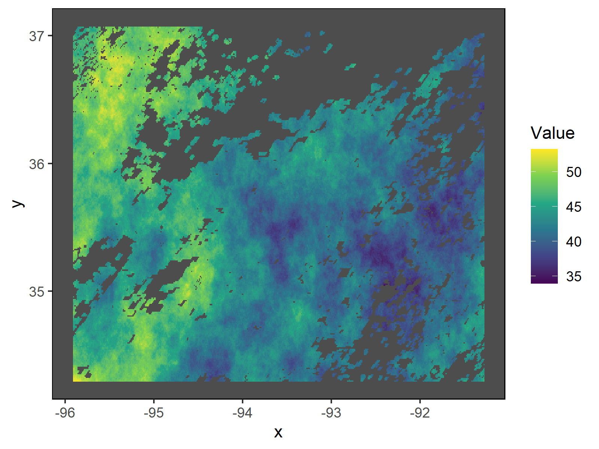
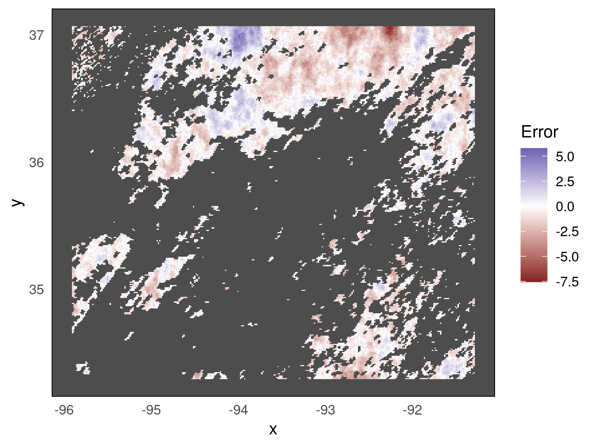

# Neural Nets as Gaussian Processes

## Introduction

The primary challenge of spatial statistics is to account for the inherent correlation that arises in the data due to proximity in sampling locations. To account for this correlation, spatial statisticians traditionally use the Gaussian process (GP). However, the GP is plagued by computational intractability, rendering it infeasible for use on large spatial data sets. On the other hand, neural networks (NNs) have arisen as a flexible approach for modeling nonlinear relationships. To date, however, neural networks have only been scarcely used for problems in spatial statistics. In this collaborative research work with Dr. Matthew J. Heaton ([https://statistics.byu.edu/directory/heaton-matthew](https://statistics.byu.edu/directory/heaton-matthew)), we implement neural networks for spatial data (for a writeup of the work we have done as of April 15, 2022, see [**Substituting Neural Networks for Gaussian Processes**](https://github.com/skylerg022/nn-as-gp/blob/main/masters_writeup_4_15.pdf)). This directory contains the code from this research work necessary to implement the network fitting and predicting yourself.

This code facilitates formatting and fitting fully-connected neural networks to big data with only 2-dimensional location information and a continuous or binary outcome for each observation. We optimize hyperparameter settings via gridsearch, fit a neural net to big data, and evaluate our predictions for some withheld test set. Below is an example of fitting a neural network to the simulated surface temperature training data from the **Quant150K_Sim** dataset (left). The performance of our best fit neural network (predicted - actual) on extrapolating surface temperatures for regions with cloud cover is also included (right).

<p float="middle">
  
  
</p>

**Disclaimer**: These results are not replicable because of parallelization and large search grids used in optimizing hyperparameters.

## Requirements

The grid search code for this project uses parallel processing and is meant to be run via the command line on either a MacOS or Linux machine. However, all other code can be run on any type of operating system. Ideally, you should have at least one machine with 16 cores and around 126 GB of RAM for the grid search computations.

Run the following installation commands in R to be capable of running all included code:

```
packs <- c('tidyverse', 'keras', 'parallel',
           'pryr', 'lme4', 'raster',
           'Rspectra', 'colorspace')
install.packages(packs)
keras::install_keras()
```

## Directions

This brief section provides all the direction you need to evaluate our model's performance on a particular spatial dataset. In the **dataset** directory, create a folder for your new dataset (with no spaces). Create an **eda.R** file in this new directory as well as a **data** folder with the original dataset file, whether it is a csv, txt, or other type of file.

Write the **eda.R** file to read the original dataset file. Save the data as **data/DataSplit.RData** with six different matrix objects: x_train, x_val, and x_test should be the 2-column matrices representing the location of each observation and y_train, y_val, and y_test be 1-column matrices with the response variable, whether binary or continuous.

After writing and running your **eda.R** file, you are ready to run the grid search algorithm. Due to the size of the gridsearch, we recommend dividing the grid search code among at least four different computing sources. A 4-batch version of **gridsearch.R** is provided in the **alt_gridsearch** directory. The following four lines of code should be run in the **alt_gridsearch** folder on different computers using the Bash command line:

```
R CMD BATCH --no-save '--args <dataset> <binary_data>' batch1.R <logfile1>.Rout &
R CMD BATCH --no-save '--args <dataset> <binary_data>' batch2.R <logfile2>.Rout &
R CMD BATCH --no-save '--args <dataset> <binary_data>' batch3.R <logfile3>.Rout &
R CMD BATCH --no-save '--args <dataset> <binary_data>' batch4.R <logfile4>.Rout &
```

where \<dataset\> is a string for the name of the directory holding the eda.R and data files of a given dataset and \<binary_data\> is either TRUE or FALSE to indicate whether the response data is binary or continuous. \<logfile\>.Rout is the file that will record output produced by the R file. The ampersand symbol (&) at the end will make this job run in the background.

If you would like to run everything on one computer, run the following line of code in the main directory:

```
R CMD BATCH --no-save '--args <dataset> <binary_data>' gridsearch.R <logfile>.Rout &
```

Running the gridsearch.R or batch.R scripts will produce gridsearch result datafiles in the **data/gridsearch** directory.

Next, run the **grid_analysis.R** file next using

```
R CMD BATCH --no-save '--args <dataset> <binary_data>' grid_analysis.R <logfile>.Rout &
```

This will produce (1) a file called **final_model_setup.csv**  in the **data** directory that contains the best hyperparameter settings for the eight input-gridsearch structures and (2) summary plots about best performing neural networks (in terms of validation set RMSE or Cross-entropy loss) for each width-depth neural network framework. These plots are found in the **pics/gridsearch** directory.

Lastly, run the **fit_NNs.R** code to fit four of the eight final models, producing prediction plots in **pics/final** and the train and test (if available) metrics for model predictions:

```
R CMD BATCH --no-save '--args <dataset> <binary_data>' fit_NNs.R <logfile>.Rout &
```


## Directory Structure

The purposes of the directories in this repository are outlined below:

- **datasets**: Houses the unique exploratory data analysis file **eda.R**, all data, and analysis plots of each dataset.

- **functions**: Contains helper functions used in the analysis files.

- **concepts**: Contains modeling concepts discussed in the [Master's project writeup](https://github.com/skylerg022/nn-as-gp/blob/main/masters_writeup_4_15.pdf).

- **alt_gridsearch**: Contains code for splitting up the grid search work for eight input-gridsearch combinations, considering four different model input types (raw location data, appended squared location data transformation, coarse radial basis function expansion, and multi-resolution -- both coarse and fine-- radial basis function expansion) and two different hyperparameter search grids (a custom grid and another referred to as Lee2018).


## Data

Only the data used in **ToyDataset** are included in this repository. A brief description and the data file locations of each dataset are provided below (Note: you will need to create the **data** directory within each dataset folder):

- **Quant150K_Sim**: Simulated land surface temperature data whose test observations represent missing data due to cloud cover. The data is available to download at [https://github.com/finnlindgren/heatoncomparison/tree/master/Data](https://github.com/finnlindgren/heatoncomparison/tree/master/Data). Save **AllSimulatedTemps.RData** into the **Quant150K_Sim/data** directory. 

- **Quant150K**: Real land surface temperature observations. Located at the same place as **Quant150K_Sim**'s data. Save **AllSatelliteTemps.RData** into the **Quant150K/data** directory.

- **Quant1Mil_G5**: Gaussian simulated data with a sample size of 1 million from the "Competition on Spatial Statistics for Large Datasets" by Huang et al. (2021). The data is available at [https://doi.org/10.25781/KAUST-8VP2V](https://doi.org/10.25781/KAUST-8VP2V). Save **dataset01_training.csv**, **dataset01_testing.csv**, and **truemeasurements/Z_01.csv** from the **Sub-competition_2b** folder into the **Quant1Mil_G5/data** directory of this repository.

- **Quant1Mil_NG1**: Non-Gaussian simulated data with a sample size of 1 million from the same location as **Quant1Mil_G5**. Save **dataset01_training.csv**, **dataset01_testing.csv**, and **truemeasurements/Z_01.csv** from the **Sub-competition_2b** folder into the **Quant1Mil_G5/data** directory of this repository.

- **Binary1Million**: 

- **ToyDataset**: A subsample of about 9,000 observations from **Quant1Mil_NG1**.

